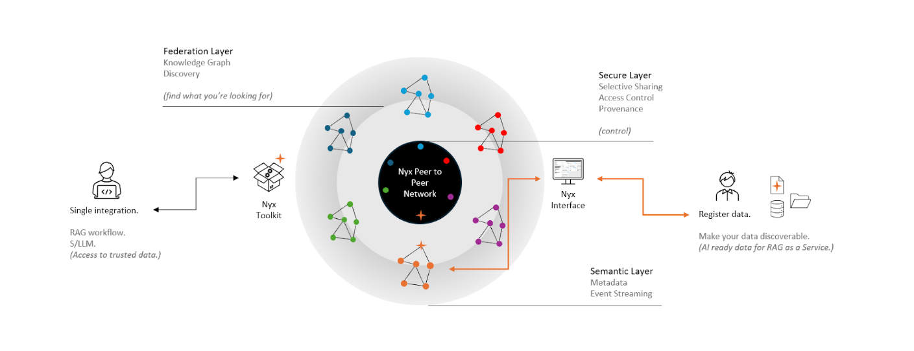

# Nyx
"The secure data exchange for Generative AI and decentralised RAG"

## 🚧 Status

The Nyx ecosystem is at an early stage of its development, please give us feedback through the [Github issues](https://github.com/Iotic-Labs/nyx-sdk/issues).

## 💡 Shortcuts

- [**Nyx Client SDK**](./nyx_client/README.md)
- [**Nyx Client SDK Extras (including RAG integration) **](./nyx_extras/README.md)
- [**Nyx Client SDK examples**](./examples)
- [**FAQ**](./FAQ.md)

## 📋 What is Nyx?

Nyx is a revolutionary, decentralised application that addresses the principal challenge adopting Generative AI within
enterprise: secure, trusted access to domain-specific, contextualised and real-time data.

Nyx brings together communities of proprietary data producers and data consumers in a secure, transparent, and
user-friendly environment.

Designed to be effortlessly integrated into AI workflows, Nyx allows you to:

- Leverage the benefits of AI with real time, relevant data
- Experiment rapidly with data within RAG-based Generative AI
- Access relevant, proprietary data for fine-tuning
- Prepare and securely share your data for use within AI applications

Nyx is built upon trusted, secure technology which allows individuals, organisations,
communities and siloed departments to interact with agility and confidence.

## 🤔 Why Nyx?

### As a data producer you can:

1. Maintain full control over where your data is stored and how it is accessed. Nyx does not centralize or store your data, but ensures it is easily discoverable.
2. Enable your data to be AI-ready and elevate the value of your data team/function.
3. Use intuitive publishing tools through the no-code Nyx UI or seamlessly integrate with existing systems via the Nyx SDK.
4. Keep governance and control over who can discover and access your data.

### As an application builder you can:

1. Use a single point of interface for accessing relevant, proprietary data across your community.
2. Access real-time, trusted data on which to build impactful AI-enabled services or products, not available via general
   intelligence models.
3. A super simple Nyx SDK enabling rapid integration of RAG with the industry’s best AI models.
4. Ensure that data veracity and compliance is maintained.

## Why is Nyx Different from other data products?

Think about some of the challenges you encounter every day in the delivery of data products and services to your
organisation. You’re likely to have experienced some of these:

- **Access to data:** Most data sources are stuck behind access points with only primitive access controls. This
  requires data owners to relinquish control through provisioning of user accounts to third parties, or to physically
  expose data assets externally, in order to enable sharing. This is unscalable in today’s Generative AI world, where
  timely contextual data unlocks a universe of possibilities. Nyx provides a truly self-sovereign data sharing
  capability where each participant only ever interacts with their own Nyx instance - there’s never any sharing of
  infrastructure, system access, or user accounts.
- **Pipeline spaghetti:** Traditional data pipeline integrations require bespoke connections to a multitude of APIs,
  databases and file stores, presenting an endless maintenance and upgrade headache. Nyx becomes your single entry point
  into a universe of knowledge, optimising your development workflow and minimising integration effort. Function (Tool)
  call using popular Language Models directly into a single pipeline for the relevant information you need.
- **Dark data:** data resides, undocumented, in siloed data stores where it costs the organisation money in terms of
  storage and data infrastructure maintenance costs and presents no apparent business value. In order for the business
  to realise the value of data assets, Nyx makes data accessible, findable and understandable by those who are building
  products and services, or making decisions.
- **Open data:** Free and open data is great, but finding what you want, in a usable format, with sufficient assurance
  over quality, timeliness and consent is frustrating. Nyx enables AI systems to find relevant data by giving producers
  the means to describe their data using industry-standard semantic properties.
- **No data contracts:** even if data is available today, there’s no guarantee that it will be available tomorrow. To
  increase trust in data, Nyx enables data assets to be published with contracts and usage rights, giving confidence to
  those who are consuming it.

## 🔥 How to use Nyx

### As a data producer

#### I want to _Connect My Data_

**Using the Nyx app**

1. Login using your username and password
2. Click on "Connect My Data"
3. Use the widget to make it available in Nyx

**Using the Nyx Client SDK**

See [I want to connect my Data](./nyx_client/README.md#I-want-to-connect-my-data)

### As an application builder

#### I want to subscribe to some data

**Using the Nyx app**

1. Login using your username and password
2. Search for some keywords and filter the result by "Genres", "Categories", "Data Producers", and more
3. Choose some interesting Data and click on "Subscribe"

**Using the Nyx SDK**

Coming soon.

#### I want to consume the data

**Using the Nyx app**

1. Login using your username and password
2. Click on your user icon on the right hand side
3. Select "My Subscriptions" from the menu
4. Click on "Download data" from a given subscription

**Using the Nyx SDK**

See [I want to consume the data](./nyx_client/README.md#I-want-to-consume-the-data)
